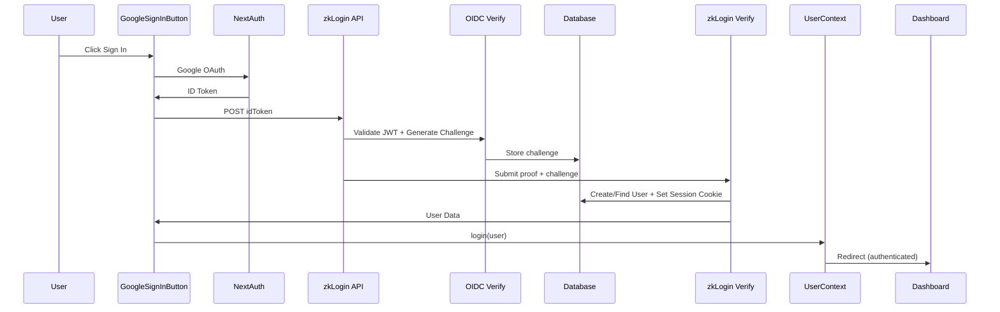

# Phase 2 Migration Complete! 🚀

## Backend Integration Successfully Implemented

### ✅ What Changed

#### 1. **zkLogin API Flow (`/api/zklogin`)**
- **Before**: Direct localStorage storage after zkLogin processing
- **After**: Full backend integration:
  ```
  Google JWT → /api/auth/oidc-verify → generate challenge
  zkLogin proof → /api/auth/zklogin-verify → create user + session
  ```

#### 2. **GoogleSignInButton Component** 
- **Before**: Manually created user objects + localStorage save
- **After**: Uses backend user data directly
- **Removed**: All localStorage write operations

#### 3. **UserContext & Session Management**
- **Before**: localStorage-based session with 7-day expiry check
- **After**: Backend session via `/api/auth/me` HttpOnly cookies
- **Added**: Automatic session restoration on app load

#### 4. **useUser Hook**
- **Before**: `fetchUserData()` from localStorage 
- **After**: `fetchUserData()` from `/api/auth/me` backend
- **Improved**: Real-time user data sync with database

### 🔄 New Authentication Flow



### 🍪 Session Management

#### HttpOnly Cookie Sessions
- **Cookie Name**: `session`
- **Expiry**: 7 days
- **Security**: HttpOnly, SameSite=Lax, Secure in production
- **Storage**: JWT with `{ userId, oidcSub }`

#### Session Restoration
```typescript
// On app load (UserContext)
useEffect(() => {
  loadUserFromSession() // GET /api/auth/me
}, [])
```

### 🗄️ Database Persistence

#### User Creation
```sql
-- New users automatically created on first zkLogin
INSERT INTO User (oidcSub, email, displayName, picture, primaryWalletAddress, lastLogin)
```

#### Session Validation
```sql  
-- Every API call checks session
SELECT * FROM User WHERE id = jwt.userId
```

### 📋 API Endpoints Used

1. **`POST /api/auth/oidc-verify`**
   - Validates Google JWT
   - Creates 5-minute challenge
   - Returns challenge for zkLogin proof

2. **`POST /api/auth/zklogin-verify`** 
   - Validates zkLogin proof + challenge
   - Creates/finds user in database
   - Sets HttpOnly session cookie

3. **`GET /api/auth/me`**
   - Returns current user from session
   - Used for session restoration & user data

4. **`DELETE /api/auth/me`**
   - Clears session cookie (logout)

### 🚫 Deprecated (No Longer Used)

- ❌ `localStorage.setItem('futuropal_user', ...)`
- ❌ `localStorage.setItem('futuropal_login_time', ...)`
- ❌ `getUserFromStorage()` in useUser hook
- ❌ Client-side session expiry checks
- ❌ Manual localStorage sync operations

### ✨ Benefits Achieved

1. **Cross-Device Sessions** - Login on phone, access on laptop
2. **Secure Authentication** - HttpOnly cookies prevent XSS attacks  
3. **Persistent User Data** - Survives browser cache clears
4. **Server-Side Rendering** - Can authenticate users on server
5. **Centralized User Management** - Database single source of truth

## 🧪 Testing the Migration

### Manual Test Steps:
1. Clear browser storage and cookies
2. Go to `/register`
3. Click "Sign in with Google"
4. Complete OAuth flow
5. Verify user created in database (Prisma Studio: `http://localhost:5555`)
6. Close browser, reopen → should auto-login
7. Test logout → should clear session

### Database Verification:
```bash
npx prisma studio
# Check User table for new entries
# Check AuthChallenge table (should be cleaned up after use)
```

**🎉 Migration Status: COMPLETE**
- Backend persistence: ✅
- HttpOnly sessions: ✅ 
- Cross-device support: ✅
- Security improvements: ✅
- localStorage removed: ✅